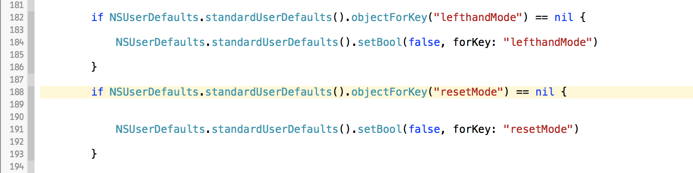

# 10 Resources I found building my first app:
#### Made as part of a talk for [Sheffield Swift](https://github.com/SheffieldSwift)

In the making of my app, I found some resources I’d like to mention / share with you!

[1. Xcode](#xcode)

[2. Treehouse](#treehouse)

[3. Cocoapods](#cocoapods)

[4. TestFlight](#testflight)

[5. Git](#git)

[6. StackOverFlow](#stackoverflow)

[7. Swift Bootstrap](#swiftbootstrap)

[8. Sketch](#sketch)

[9. Icons](#icons)

[10. X in Y Minutes](#xiny)

<a name="xcode"></a>
## 1. Xcode

Xcode is the main IDE for building iOS and Mac apps, here is a couple of tips and tricks within Xcode:

### Turn on line numbers

Line numbers allow you to easily know exactly where you are in your document and have a reference of where to put breakpoint and locate errors or bugs.

Turn on in preferences:

```
Xcode > Preferences > Text Editing > Line numbers
```
[
](https://stackoverflow.com/questions/5901758/where-do-i-find-the-line-number-in-the-xcode-editor)


### Keep your code structured with re-indent

Hitting *Control* + *I* on selected text will re-indent, allowing for clearer reading of code and the structures within it.

### Jump to definition shortcut

Right clicking on a variable, class or function will give the option to *Jump to Definition*, allowing you to quickly see the definition in the code.

*Alt* + *Click* is also a neat way of showing relevant information of an object.

### Open Quickly


*Command* + *Shift* + *O* - This shortcut opens a dialog allowing the user to quickly find files within current project or workspace.

### MVC folder system

MVC stands for Model-View-Controller and is a design philosophy when building apps. I tried a slight experiment with my project creating folders for each part of the acronym and organising the relevant code into each folder, making it more managable in the sidebar.

### Comment your code

Select text and use the shortcut: *Command* + */*

In Swift:

``` swift
// single line comments look like this

/* multi-line 
comments can
span multiple 
lines */
```

#### If you don’t already comment your code:

##### Help yourself 
Commenting is as simple as write down and explaining what sections of your code are doing. Imagine looking back on your code in a years time. Without comments it will make it harder to understand and possibly unreadable. Having comments helps you to pick up where you left off and easily navigate your code.


##### Help others 
If you are working on a group project, framework or asking for help, other people might look at your code or reference it, so it needs to be clear and legible.


<a name="alcatraz"></a>
## Alcatraz


Alcatraz is a package manager for Xcode allowing you to quickly install plugins, themes and templates.

[http://alcatraz.io/](http://alcatraz.io/)

#### XToDo

XToDo is a plugin that collects and lists marks - MARK, TODO, FIXME, ???, !!!


Marks in Swift - think of marks as comment or section titles which are easy to get to from the Xcode jump bar or search.

In Swift:

``` swift
// MARK:
// TODO:
// FIXME: 
```
These marks are similar to pragma marks found in Objective-C.

[https://github.com/trawor/XToDo](https://github.com/trawor/XToDo) or [via Alcatraz](#alcatraz)

#### Backlight



Plugin that highlights the line you are editing, never lose your cursor again!

[https://github.com/limejelly/Backlight-for-XCode](https://github.com/limejelly/Backlight-for-XCode) or [via Alcatraz](#alcatraz)


<a name="treehouse"></a>
## 2. Treehouse


Subscription based tutorial site covering web design, front end development, mobile development etc

I'd recommend trying the 14 day free trial, all the courses are self-paced and can be downloaded and there is an iPad app. 

If you are a student, email the support area and ask for the student discount (it's pretty hidden) about a 1/3 of the standard price and they don't shout about it.

Recommended courses / videos:

* [Swift Track (group of courses)](https://teamtreehouse.com/tracks/ios-development-with-swift)
* [Cocoapods setup guide](http://teamtreehouse.com/library/ios-tools)
* [Swift Enums and Structs](http://teamtreehouse.com/library/swift-enums-and-structs)
* [Object-Orientated Swift (Structs and Classes)](http://teamtreehouse.com/library/objectoriented-swift)
* [iOS Submitting to the App Store](http://teamtreehouse.com/library/ios-submitting-to-the-app-store)
* [What’s New in Swift 2.0](http://teamtreehouse.com/library/whats-new-in-swift-20)


[My Profile](https://teamtreehouse.com/matthewspear)

[https://teamtreehouse.com/](https://teamtreehouse.com/home)

[My Referral Link](http://referrals.trhou.se/matthewspear)


<a name="cocoapods"></a>
## 3. Cocoapods


Dependancy manager for Swift & Objective-C

[https://cocoapods.org/](https://cocoapods.org/)

Notable Pods from my Project:

* [Fabric / Crashlytics](https://cocoapods.org/pods/Crashlytics)
* [Parse (PFPurchase is useful for IAP)](https://cocoapods.org/pods/parse)
* [SVProgressHUD](https://cocoapods.org/pods/SVProgressHUD)
* [VTAcknowledgementsViewController](http://cocoapods.org/pods/VTAcknowledgementsViewController)

### Finding cool pods:

I browse these two sites every now and again to keep an eye on what is possible with cocoapods.

 [Trending Cocoapods](https://trendingcocoapods.github.io/)

[What the Pod](http://www.whatthepod.com/)

Also the [@CocoaPodsFeed](https://twitter.com/cocoapodsfeed) account on Twitter posts recent / interesting pods.

<a name="testflight"></a>
## 4. TestFlight


Easy access to beta testing features for both internally and externally from within iTunes Connect.

Testing the apps you build is important and I caught a couple of bugs that I would never have caught unless I'd put it on different devices and checked it.

Requires the Apple developer account (£79 per year).

<a name="git"></a>
## 5. Git


Git is a version control system, not to be confused with GitHub (which uses git, just remember they aren’t the same thing).

I used a feature per branch, when finished a feature I would test it then merge back to master.

Using git allowed me to easy to roll back code if I messed anything up and easily branch and try experimental ideas without endangering the project.

super useful command:

``` bash
git checkout -b <feature name here>
```
The command creates and switches to a new feature branch instantly, instead of having to make the branch then switch to it.

Another one:

``` bash
git diff <commit> <commit>
```

Allows you to compare two commits / branches and see the **diff**erences.

[https://git-scm.com/](https://git-scm.com/)

<a name="stackoverflow"></a>
## 6. StackOverFlow

A site for posing any of your programming questions, if you are struggling with any Swift or Xcode problem, someone has probably already answered it here.

[https://stackoverflow.com/](https://stackoverflow.com/)

<a name="swiftbootstrap"></a>
## 7. Swift Bootstrap


Swift Bootstrap is a site with a couple of tools to speed up building an app, I've listed the tools here:

* Palette - Generate colour palettes for your iOS project in seconds.
* Onboarding - Quickly create onboarding slides for your iOS project.
* Screenshots - Generate app screenshots for all iPhone sizes.
* Color - Swift and Objective-C UIColor picker.
* Loading - Quicky add loading spinners to your iOS project.

[http://www.swiftbootstrap.com/](http://www.swiftbootstrap.com/)

<a name="sketch"></a>
## 8. Sketch - Mock ups / UI Design


An alternative to Photoshop with a strong focus on UI design, it has become increasingly popular in the design community and is a fraction of the price of anything Adobe makes!

Students - 50% discount under educational licence, well worth it.

[http://bohemiancoding.com/sketch/](http://bohemiancoding.com/sketch/)

<a name="icons"></a>
## 9. Icons

### NounProject


So many icons, with the option to download under the Creative Commons Licence (free with attribution) or otherwise royalty free the icons are ~£2 each. An option has been added to get unlimited downloads via subscription ~£7 a month. 

[https://thenounproject.com/](https://thenounproject.com/)

### IconStore - Free Icons


Packs of Icons by "First-Class Designers" completely free, both personal and commercial use and no attribution required.

[http://iconstore.co/](http://iconstore.co/)

<a name="xiny"></a>
## 10. Learn X in Y Minutes - Swift


Examples of the functionality of the Swift language in a single document, this site offers other languages and gives you a jumpstart into any new language you want to learn!

[http://learnxinyminutes.com/docs/swift/](http://learnxinyminutes.com/docs/swift/)
